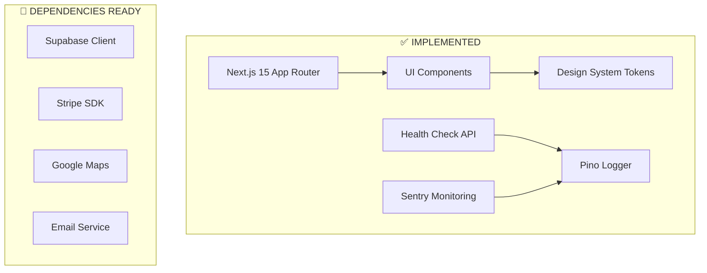

# 🏗️ ARCHITECTURE - Vantage Lane 2.0

**Current technical architecture and implementation**

> 📍 **Note**: This document reflects **current implementation**. For planned business features, see [ROADMAP.md](./ROADMAP.md)

## 🎯 **CURRENT STATUS & SCOPE**

### **What is Implemented:**

Modern web application foundation built with **Next.js 15** + **React 19** for luxury chauffeur services. Currently focuses on **UI/UX foundation** and **design system** implementation.

### **Current Capabilities:**
- ✅ **Premium UI Components**: LuxuryCard, design system, responsive layouts
- ✅ **Modern Tech Stack**: Next.js 15, TypeScript, Tailwind CSS  
- ✅ **Development Tools**: ESLint, AI Guardian, monitoring setup
- ✅ **Foundation Infrastructure**: Logging, health checks, environment management

### **Business Logic Status:**
- 🔮 **Planned**: Booking system, payments, user authentication (see [ROADMAP.md](./ROADMAP.md))

## 🏛️ **HIGH-LEVEL ARCHITECTURE**

### **Current Architecture Pattern: Next.js App Router + Component-Based**



## 🗂️ **DETAILED FOLDER ARCHITECTURE**

### **🎯 Design Principles:**

1. **Separation of Concerns:** Clear boundaries între layers
2. **Single Responsibility:** Fiecare modul are o responsabilitate
3. **Dependency Inversion:** High-level modules nu depind de low-level
4. **Feature-based Organization:** Group by business domain
5. **Scalability First:** Structure suportă growth fără reorganization

### **📁 Core Architecture Layers:**

#### **Layer 1: Application (`/src/app/`)**

```
✅ IMPLEMENTED
Purpose: App Router pages and API routes
Files: page.tsx, layout.tsx, api routes
Technologies: Next.js 15 App Router, React 19
```

#### **Layer 2: Components (`/src/components/`)**

```
✅ IMPLEMENTED  
Purpose: UI components and layouts
Files: LuxuryCard/, Button.tsx, Layout.tsx, etc.
Technologies: React 19, Tailwind CSS, Radix UI
```

#### **Layer 3: Utilities & Infrastructure (`/src/lib/`)**

```
✅ IMPLEMENTED
Purpose: Logging, monitoring, utilities, health checks
Files: health.ts, logger/, monitoring/, utils/
Technologies: Pino (logging), Sentry (monitoring), TypeScript
```

#### **Layer 4: Configuration (`/src/config/`, `/src/design-system/`)**

```
✅ IMPLEMENTED
Purpose: App configuration and design system
Files: theme.config.ts, colors.ts, breakpoints.ts
Technologies: TypeScript, design tokens, Tailwind config
```

---

## 🧩 **COMPONENT ARCHITECTURE (Current Implementation)**

### **Component Hierarchy & Responsibilities:**

#### **🎨 UI Components (`/src/components/ui/`)**

- **Purpose:** Reusable, styled base components
- **Examples:** LuxuryCard, Button, Badge, Text, theme-toggle
- **Dependencies:** Design system tokens, Radix UI, Tailwind CSS
- **Pattern:** Modular components with TypeScript interfaces

#### **🏗️ Layout Components (`/src/components/layout/`)**

- **Purpose:** Page structure and navigation  
- **Examples:** Layout, Navbar, Footer, Container, Section
- **Dependencies:** UI components, design system
- **Pattern:** Composition and responsive design

#### **🔮 Feature Components (`/src/components/features/`)**

- **Status:** Folder structure ready, implementations planned
- **Purpose:** Business-specific components (when implemented)
- **Planned:** Booking forms, user dashboards, payment flows
- **Dependencies:** Will use UI components + business services

#### **📝 Form Components (`/src/components/forms/`)**

- **Status:** Folder structure ready, basic form patterns available
- **Dependencies:** react-hook-form, zod (available in package.json)
- **Pattern:** Form validation with TypeScript interfaces

---

## 🏗️ **TECHNOLOGY STACK (Current Implementation)**

### **✅ Frontend Stack**
- **Framework:** Next.js 15 (App Router)
- **UI Library:** React 19
- **Styling:** Tailwind CSS 3.4 + design tokens
- **Components:** Radix UI primitives
- **State:** Built-in React state (Zustand available)
- **Animation:** Framer Motion 11
- **Icons:** Lucide React

### **✅ Development & Quality**  
- **Language:** TypeScript (strict mode)
- **Linting:** ESLint 9 + @typescript-eslint
- **Formatting:** Prettier + lint-staged
- **Quality:** AI Guardian Enterprise (custom)
- **Testing:** Vitest + React Testing Library (configured)
- **Git:** Husky hooks + Commitlint

### **✅ Monitoring & Infrastructure**
- **Logging:** Pino + pino-pretty
- **Monitoring:** Sentry (configured, ready to use)
- **Analytics:** Vercel Analytics (available)
- **Environment:** envsafe for validation

### **🔮 Ready Dependencies (Not Yet Implemented)**
- **Database:** Supabase (client + auth helpers)
- **Payments:** Stripe + Stripe.js
- **Email:** Resend (configured)
- **Maps:** Google Maps JS API Loader
- **Cache:** Upstash Redis
- **HTTP:** ky (modern fetch wrapper)

---

## 🎯 **ARCHITECTURE PRINCIPLES**

### **Current Implementation Philosophy:**
1. **Foundation First:** Solid UI/UX base before business logic
2. **Type Safety:** TypeScript everywhere, strict mode enabled
3. **Component-Driven:** Reusable, modular UI components
4. **Modern Stack:** Latest Next.js, React, and tooling
5. **Quality Focus:** AI Guardian, ESLint, Prettier, testing setup

### **Future Scalability:**
- **Clean Architecture**: Will be implemented when business logic is added
- **Domain-Driven Design**: Structure ready for business domains
- **External Integrations**: Dependencies installed, ready for implementation

> 📚 **Next Steps**: See [ROADMAP.md](./ROADMAP.md) for planned architecture evolution and business feature implementation.
