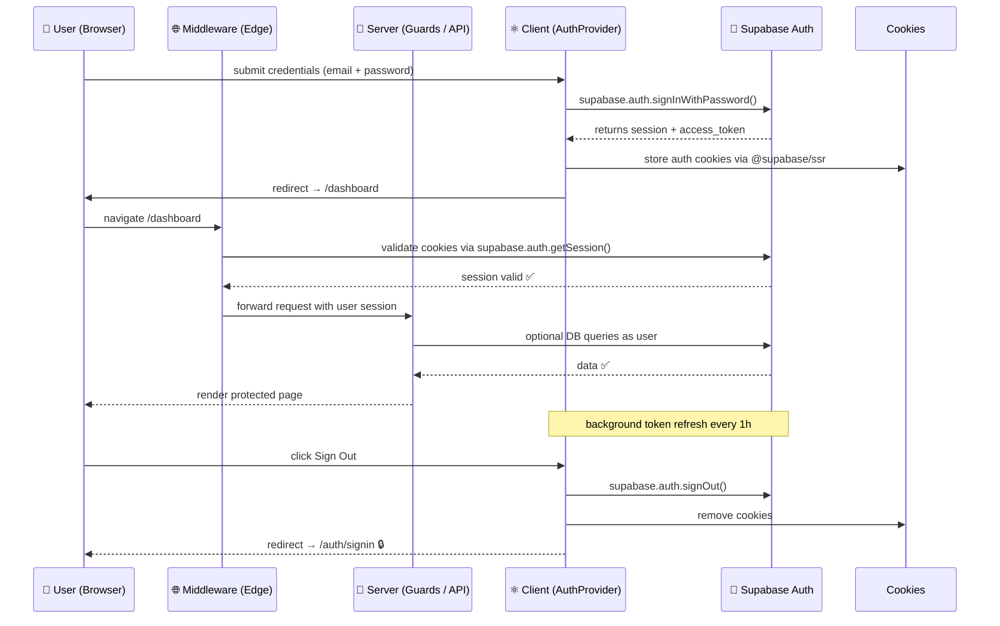

# 🔐 VANTAGE LANE 2.0 – AUTH ARCHITECTURE

**Enterprise-grade authentication architecture designed for Next.js 15 + Supabase 2.x**  
_Unified SSR + CSR flow with full session persistence and guards._

## 🧩 1️⃣ Overview

Arhitectura Auth în Vantage Lane este construită în 3 straturi complementare:

| Layer                     | Responsabilitate                                | Tehnologie                       |
| ------------------------- | ----------------------------------------------- | -------------------------------- |
| **Middleware (Edge)**     | Protejează rutele și redirecționează automat    | `@supabase/ssr` + `NextResponse` |
| **Server Guards (SSR)**   | Acces sigur în Route Handlers și Server Actions | `auth.guard.ts`                  |
| **Client Provider (CSR)** | Sincronizează sesiunea, user-ul și UI state     | `AuthProvider` + `useAuth()`     |

Toate aceste straturi comunică prin același mecanism de sesiune gestionat de Supabase (Auth Cookies).

## ⚙️ 2️⃣ Lifecycle Flow

### 🔄 Login → Access → Refresh → Logout



## 🧱 3️⃣ Middleware Layer

### 🔹 `src/middleware.ts`

| Funcție                    | Descriere                                                        |
| -------------------------- | ---------------------------------------------------------------- |
| 🔍 **Detectează sesiunea** | Obține cookies și verifică sesiunea Supabase                     |
| 🚧 **Protejează rutele**   | `/dashboard`, `/account`, `/admin`                               |
| 🔁 **Redirecționează**     | Neautentificați → `/auth/signin`<br>Autentificați → `/dashboard` |
| ⚡ **Execuție**            | Edge (cel mai rapid nivel SSR)                                   |

### 🔄 Rezultate posibile

| Situație                               | Acțiune                                       |
| -------------------------------------- | --------------------------------------------- |
| User neautentificat + pagină protejată | `Redirect → /auth/signin?redirect=/dashboard` |
| User autentificat + pagină auth        | `Redirect → /dashboard`                       |
| User autentificat + pagină publică     | `Acces OK`                                    |

## 🧠 4️⃣ Server Guards

### 📂 `src/features/auth/guards/auth.guard.ts`

| Funcție            | Scop                                            | Returnează                    |
| ------------------ | ----------------------------------------------- | ----------------------------- |
| `requireUser()`    | Forțează login pentru API / server actions      | `{ supabase, session, user }` |
| `optionalAuth()`   | Obține user dacă există, altfel null            | `{ user: User \| null }`      |
| `requireRole()`    | Verifică roluri ('admin', 'operator', 'driver') | `redirect / throw 403`        |
| `hasRole()`        | Verificare silențioasă → boolean                | `true / false`                |
| `getCurrentUser()` | Returnează user fără redirect                   | `User \| null`                |

### 🔐 Exemple de utilizare

```typescript
// app/api/bookings/route.ts
import { requireUser } from '@/features/auth/guards/auth.guard';

export async function GET() {
  const { supabase, user } = await requireUser();
  const { data } = await supabase.from('bookings').select('*').eq('user_id', user.id);
  return Response.json({ bookings: data });
}
```

## ⚛️ 5️⃣ Client-Side Auth Provider

### 📂 `src/features/auth/context/AuthProvider.tsx`

| Funcție                 | Scop                                                                |
| ----------------------- | ------------------------------------------------------------------- |
| `AuthProvider`          | Creează context global cu user / session                            |
| `useAuth()`             | Hook pentru acces rapid în componente                               |
| `Auto-refresh`          | Ascultă evenimente `onAuthStateChange`                              |
| `Integrare cu Supabase` | `createClientComponentClient()` din `@supabase/auth-helpers-nextjs` |

### 🔄 State Flow

| State       | Descriere                        |
| ----------- | -------------------------------- |
| `isLoading` | `true` → în timpul inițializării |
| `user`      | `User \| null` sincronizat live  |
| `session`   | Obiect complet de sesiune        |
| `signOut()` | Logout + reset state             |
| `refresh()` | Forțare revalidare sesiune       |

### 💡 Exemplu în UI

```tsx
'use client';
import { useAuth } from '@/features/auth/context/AuthProvider';

export function NavbarAuth() {
  const { user, signOut } = useAuth();

  return user ? <button onClick={signOut}>Sign Out</button> : <a href='/auth/signin'>Sign In</a>;
}
```

## 🧩 6️⃣ Shared Schema Validation

Validarea se face cu Zod (SSR + CSR compatibil):

| Schema                 | Rol                                       |
| ---------------------- | ----------------------------------------- |
| `signInSchema`         | email + password                          |
| `signUpSchema`         | email + password + confirm + nume + phone |
| `resetPasswordSchema`  | doar email                                |
| `changePasswordSchema` | current + new + confirm                   |
| `updateProfileSchema`  | câmpuri opționale (update user metadata)  |

Toate folosite în `useAuthForm()` → `react-hook-form` cu `zodResolver`.

## 🧮 7️⃣ State Map (central overview)

| Strat          | File                                      | API / Hook                           | Tipare                  |
| -------------- | ----------------------------------------- | ------------------------------------ | ----------------------- |
| **Edge**       | `/middleware.ts`                          | –                                    | `NextResponse.redirect` |
| **Server**     | `/features/auth/guards/auth.guard.ts`     | `requireUser`, `requireRole`         | SSR validation          |
| **Client**     | `/features/auth/context/AuthProvider.tsx` | `useAuth()`                          | CSR sync + events       |
| **Validation** | `/features/auth/validation/authSchema.ts` | `signInSchema`                       | Zod schemas             |
| **Services**   | `/features/auth/services/supabaseAuth.ts` | `signInWithEmail`, `signUpWithEmail` | Abstracție Supabase     |

## 🧰 8️⃣ Developer Workflows

### ▶️ Test login manually

```bash
npm run dev
# open http://localhost:3000/auth/signin
```

### 🧪 Rulează testele Zod

```bash
npm run test auth.validation.test.ts
```

### 🧹 Verifică middleware redirects

```bash
npx next build && npx next start
# navigate to /dashboard while logged out → expect redirect
```

## 🧭 9️⃣ Error Handling + Fallbacks

| Caz                               | Comportament                                            |
| --------------------------------- | ------------------------------------------------------- |
| **Network error** → Supabase down | returnează `error.message`, UI arată "Connection issue" |
| **Token expirat**                 | auto-refresh prin Supabase SDK                          |
| **User șters / blocat**           | middleware → redirect / auth.guard → 403                |
| **Middleware în SSG page**        | fallback safe (`NextResponse.next()`)                   |

## 🧩 🔟 Extensibilitate

- 🔁 **Multiple providers**: Google, Apple, LinkedIn (`signInWithProvider`)
- 👑 **Role-based access control**: `app_metadata.roles = ['admin','driver']`
- 🔔 **Audit logging**: în viitor, logăm login/logout în tabel `auth_logs`
- 🧾 **Securitate**: toate cookie-urile sunt HttpOnly, Secure, SameSite=Lax
- 🌐 **Multiplatform**: compatibil cu app mobile (Expo) → Supabase Auth API

## ✅ Rezumat General

| Nivel                 | Componentă             | Scop                   | Tehnologii                  |
| --------------------- | ---------------------- | ---------------------- | --------------------------- |
| **Frontend (CSR)**    | AuthProvider + useAuth | UI & session sync      | React Context               |
| **Middleware (Edge)** | middleware.ts          | Pre-routing auth check | Next.js Edge + Supabase SSR |
| **Backend (SSR)**     | auth.guard.ts          | Auth + role validation | Supabase Server Client      |
| **Validation Layer**  | authSchema.ts          | Data integrity         | Zod + TypeScript            |
| **Service Layer**     | supabaseAuth.ts        | Abstract API calls     | Supabase Auth SDK           |

## 🧭 11️⃣ Security Checklist

- ✅ All secrets in `.env` (SUPABASE_URL, SUPABASE_ANON_KEY)
- ✅ Cookies marked Secure + HttpOnly
- ✅ Middleware checks only protected routes
- ✅ No direct window.localStorage for tokens
- ✅ SignOut → removes cookies and clears state
- ✅ Role validation for admin routes
- ✅ Session refresh enabled automatically

## 🏁 12️⃣ Future Extensions

| Feature                        | Status         | Descriere                  |
| ------------------------------ | -------------- | -------------------------- |
| **MFA (2FA) via Supabase OTP** | 🔜             | Login cu cod SMS / Email   |
| **Magic Links Login**          | 🔜             | Sign in fără parolă        |
| **Password Reset UI**          | ✅ schema gata | UI urmează                 |
| **Audit Logs**                 | 🔜             | Persist login/logout în DB |
| **Impersonation (Admin View)** | 🔜             | Admin → login ca alt user  |

## 🏗️ 13️⃣ File Structure

```
src/
 ├─ lib/
 │   └─ supabase/
 │       └─ server.ts
 ├─ features/
 │   └─ auth/
 │       ├─ context/
 │       │   └─ AuthProvider.tsx
 │       ├─ guards/
 │       │   └─ auth.guard.ts
 │       ├─ services/
 │       │   └─ supabaseAuth.ts
 │       ├─ validation/
 │       │   └─ authSchema.ts
 │       └─ hooks/
 │           └─ useAuthForm.ts
 ├─ middleware.ts
 └─ app/
     └─ (dashboard)/
         └─ page.tsx
```

## 🎯 14️⃣ Conclusion

Arhitectura Auth din Vantage Lane 2.0 oferă:

✅ **Securitate enterprise-grade**  
✅ **Performanță Edge + SSR**  
✅ **Consistență între client și server**  
✅ **Scalabilitate pentru aplicații multi-role și multi-platformă**

🔸 **One unified authentication flow.**  
🔸 **Zero duplication between client & server.**  
🔸 **Supabase-powered, Next.js 15 optimized.**
